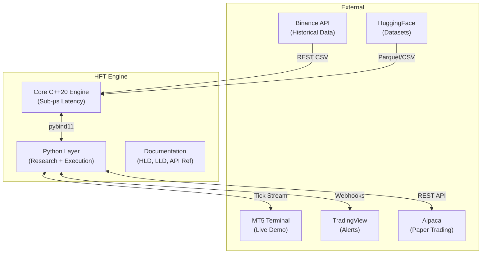
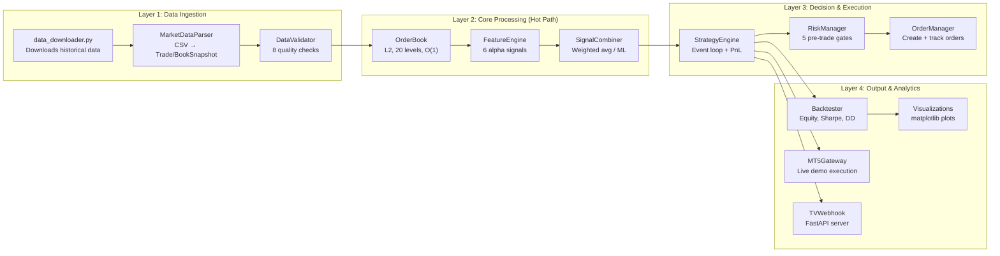
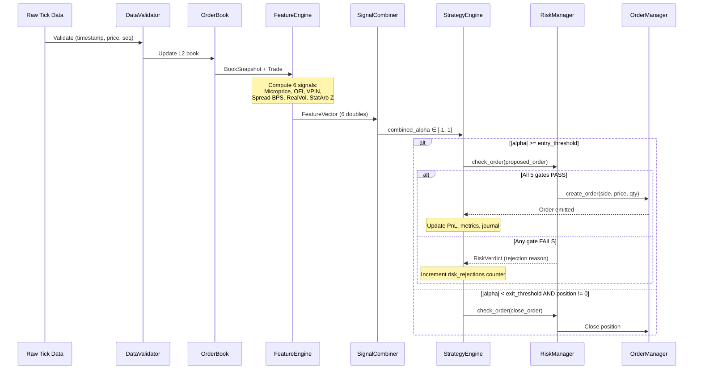
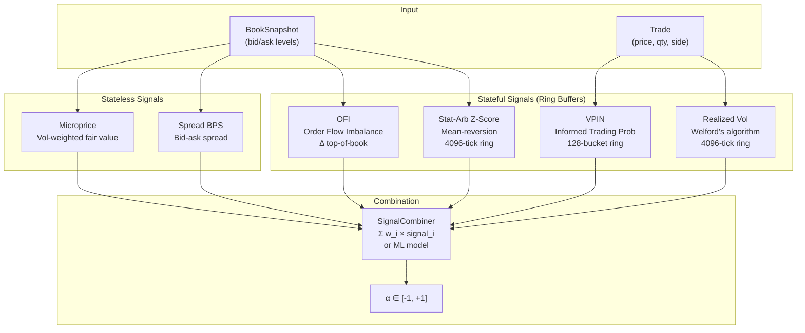
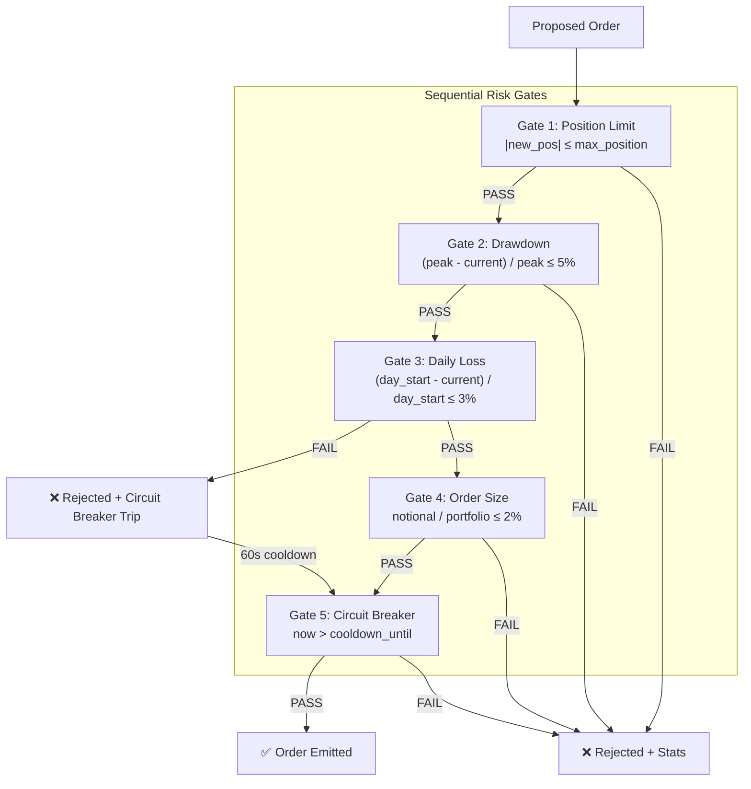
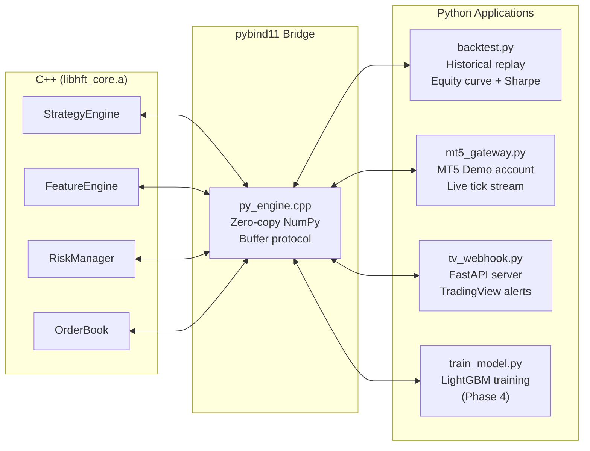

# HFT Engine — Architecture Overview

**Version**: 2.0 | **Last Updated**: August 2026

---

## 1. System Context



---

## 2. Component Architecture



---

## 3. Hot-Path Data Flow (Tick-to-Trade)

This is the critical path that must execute in **< 1 µs**.



---

## 4. Infrastructure Layer

### 4.1 Memory Architecture

```
┌─────────────────────────────────────────────────────────┐
│ Stack-Allocated (No Heap on Hot Path)                    │
│                                                          │
│  ┌──────────────┐  ┌──────────────┐  ┌──────────────┐  │
│  │ MemoryPool   │  │ SPSCQueue    │  │ Ring Buffers  │  │
│  │ Fixed blocks │  │ 2^16 slots   │  │ VPIN: 128     │  │
│  │ O(1) alloc   │  │ Lock-free    │  │ Vol:  4096    │  │
│  │ 0 fragments  │  │ Atomic fences│  │ StatArb: 4096 │  │
│  └──────────────┘  └──────────────┘  └──────────────┘  │
│                                                          │
│  Cache Line: 64 bytes │ All structs: alignas(64)        │
│  POD Types Only       │ static_assert(trivially_copyable)│
└─────────────────────────────────────────────────────────┘
```

### 4.2 Fixed-Point Number System

```
Price:    int64_t × PRICE_SCALE (10^8)
          100.50 USD → 10,050,000,000

Quantity: int64_t × QTY_SCALE   (10^8)
          0.001 BTC → 100,000

Rationale:
  ✅ Deterministic replay (no FP rounding drift)
  ✅ Exact PnL calculations
  ✅ Compatible with exchange native formats
  ✅ Faster than double on integer ALU
```

---

## 5. Alpha Signal Pipeline



---

## 6. Risk Management Architecture



---

## 7. Python Integration Architecture



---

## 8. Deployment Modes

| Mode | Entry Point | Data Source | Execution | Output |
|---|---|---|---|---|
| **Backtest** | `python backtest.py --data X.csv` | Binance CSV / HuggingFace | Simulated fills | Equity curve, Sharpe, drawdown |
| **MT5 Demo** | `python mt5_gateway.py --symbol EURUSD` | MT5 tick stream | MT5 `order_send` | Trade log CSV, slippage stats |
| **TV Webhook** | `python tv_webhook.py --port 8080` | TradingView alerts | Simulated / Alpaca Paper | REST API responses |
| **C++ Tests** | `./hft_tests` | Synthetic data | Assertions | Pass/Fail (36+ tests) |
| **Benchmark** | `./hft_bench` | Synthetic ticks | Latency timing | p50/p99 table |

---

## 9. Directory Structure

```
HFT/
├── cpp/
│   ├── core/                    # 20 files — The engine
│   │   ├── types.h              # POD types, fixed-point
│   │   ├── clock.h              # Nanosecond timestamps
│   │   ├── spsc_queue.h         # Lock-free ring buffer
│   │   ├── memory_pool.h        # Zero-alloc block pool
│   │   ├── order_book.h/.cpp    # L2 order book
│   │   ├── market_data.h/.cpp   # Parser
│   │   ├── data_validator.h/.cpp # Validation
│   │   ├── features.h/.cpp      # 6 alpha signals
│   │   ├── signal_combiner.h/.cpp # Signal aggregation
│   │   ├── risk_manager.h/.cpp  # 5 risk gates
│   │   ├── order_manager.h/.cpp # Order lifecycle
│   │   └── strategy_engine.h/.cpp # Central orchestrator
│   ├── tests/                   # 9 files — 36+ unit tests
│   │   ├── test_main.cpp
│   │   ├── test_types.cpp
│   │   ├── test_spsc_queue.cpp
│   │   ├── test_memory_pool.cpp
│   │   ├── test_order_book.cpp
│   │   ├── test_data_validator.cpp
│   │   ├── test_features.cpp
│   │   ├── test_risk_manager.cpp
│   │   └── test_strategy_engine.cpp
│   ├── bindings/
│   │   └── py_engine.cpp        # pybind11 + NumPy
│   └── bench/
│       └── latency_profiler.cpp # Tick-to-trade benchmarks
├── python/
│   ├── data_downloader.py       # Binance data acquisition
│   ├── backtest.py              # Historical replay engine
│   ├── mt5_gateway.py           # MT5 live execution
│   └── tv_webhook.py            # TradingView FastAPI
├── config/
│   └── default_config.yaml      # All tuning parameters
├── docs/
│   ├── SYSTEM_DESIGN.md         # High-Level Design
│   ├── LOW_LEVEL_DESIGN.md      # Implementation details
│   ├── ARCHITECTURE.md          # This file
│   └── API_REFERENCE.md         # Class/method reference
├── CMakeLists.txt               # Build system
├── requirements.txt             # Python dependencies
└── README.md                    # Portfolio presentation
```
