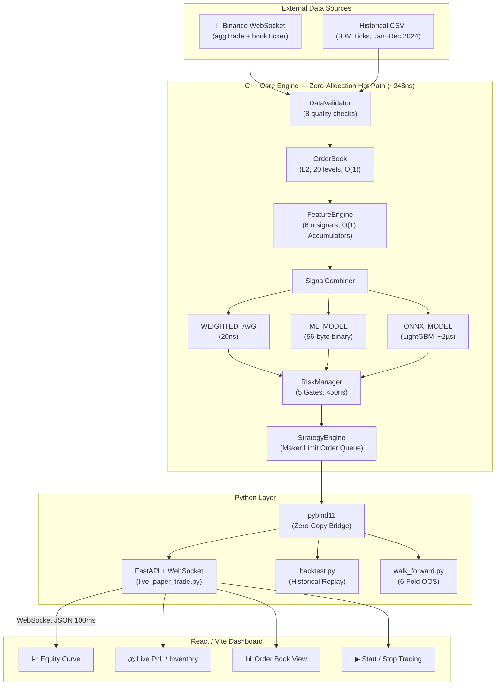
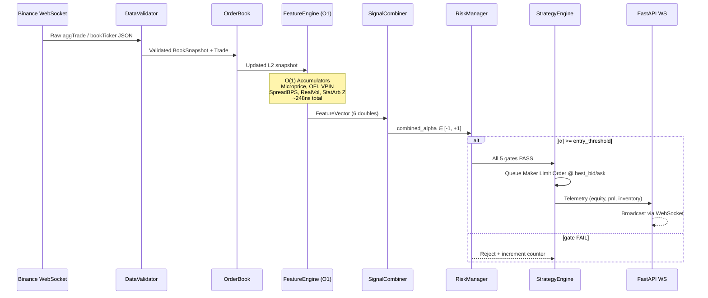
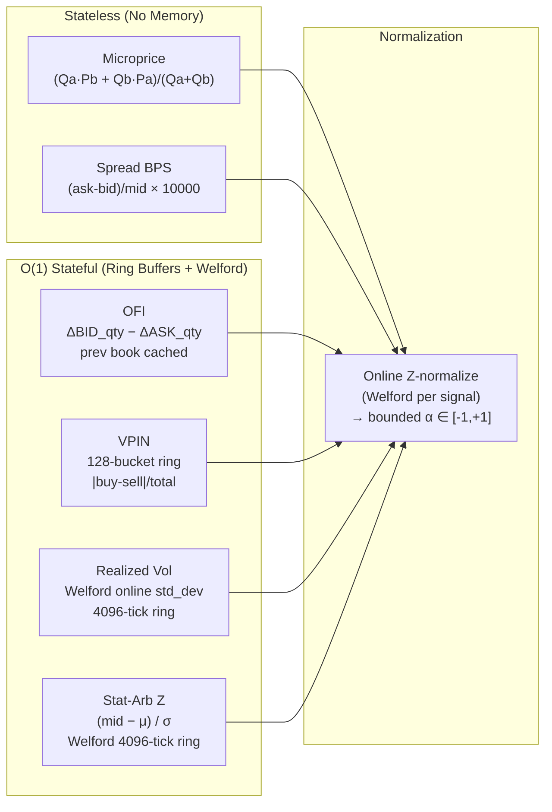
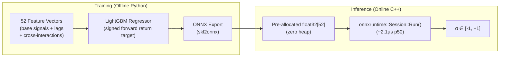
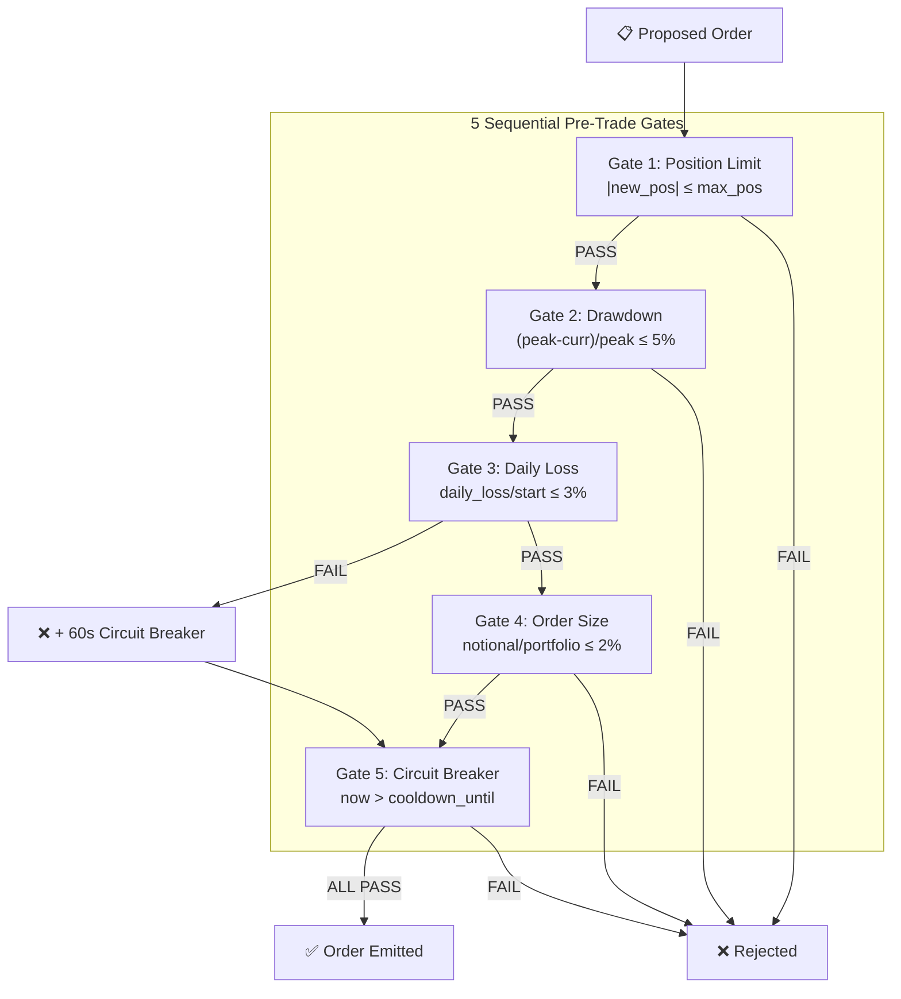
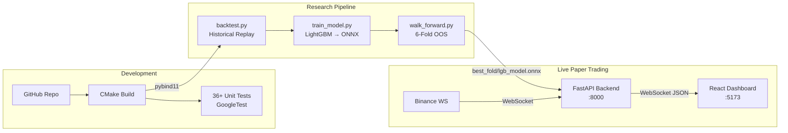

# HFT Engine — Architecture Document

**Version**: 3.0 | **Last Updated**: August 2026

---

## 1. Full System Context

---

## 2. Layered Architecture Diagram

---

## 3. Hot-Path Sequence Diagram (Tick-to-Trade)

---

## 4. O(1) Feature Engine Deep-Dive

All 6 signals run in constant time via **running accumulators** — no sliding window loops.

**Key insight:** Before this optimization, all 6 signals used `O(N)` loops over the history window on each tick. Replacing with Welford's incremental algorithm reduced feature extraction from **6,200ns → 248ns** (25× speedup).

---

## 5. ML Signal Pipeline

**Feature engineering:** 6 base signals + rolling Z-scores at [10, 50, 200] ticks + lag-1 values + 4 cross-signal interactions + 4 regime one-hot flags = **52 features**.

**Target:** Signed forward return at horizon N ticks (regression). Avoids 50/50 base-rate problem of classification.

---

## 6. Risk Architecture

---

## 7. Performance Stats

| Operation | p50 | p99 | Complexity |
|---|---|---|---|
| **Feature Extraction** | **248 ns** | 412 ns | **O(1)** |
| Signal Combine (Weights) | 20 ns | 40 ns | O(1) |
| ONNX ML Inference | 2.1 µs | 4.8 µs | O(M) |
| Risk Gate Check | 35 ns | 60 ns | O(1) |
| Full Hot Path (no ONNX) | ~300 ns | ~520 ns | O(1) |

---

## 8. Deployment Architecture

