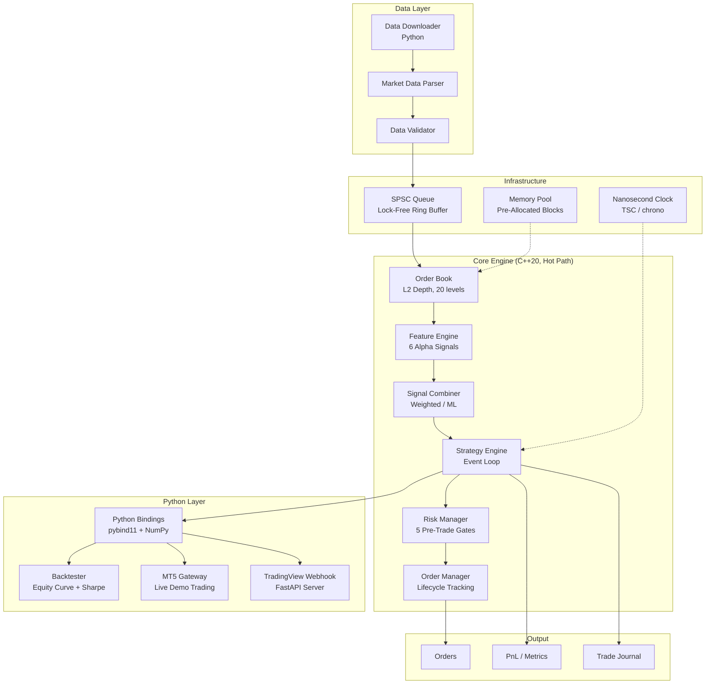
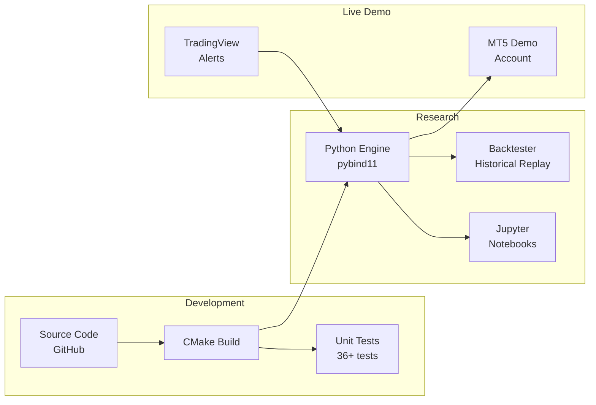

# HFT Engine — System Design Document (HLD)

**Version**: 2.0  
**Date**: August 2026  
**Author**: Varun  
**Status**: Phase 3 Complete

---

## 1. Executive Summary

This document describes the high-level architecture of a **low-latency, quantitative trading engine** built in C++20 with Python research bindings. The system is designed to demonstrate production-grade HFT capabilities to quantitative finance firms including Citadel Securities, HRT, Two Sigma, Goldman Sachs, and 40+ other target employers.

The engine processes market data through a deterministic pipeline:

```
Market Data → Order Book → Feature Engine → Signal Combiner → Risk Manager → Order Manager
```

All hot-path operations are **O(1), zero-allocation, lock-free, and cache-aligned** to achieve sub-microsecond tick-to-trade latency.

---

## 2. System Architecture

### 2.1 Architecture Diagram



### 2.2 Design Principles

| Principle | Implementation |
|---|---|
| **Zero-Allocation Hot Path** | `MemoryPool<T>` with pre-allocated blocks; no `new`/`malloc` in the critical path |
| **Cache-Line Alignment** | All hot structs use `alignas(64)` to prevent false sharing |
| **Fixed-Point Arithmetic** | Prices/quantities scaled by 10^8 as `int64_t` to avoid FP non-determinism |
| **Lock-Free Communication** | `SPSCQueue<T>` ring buffer with atomic seq_cst fences |
| **Compile-Time Bounds** | Ring buffer sizes (`MAX_VPIN_BUCKETS`, `MAX_VOL_WINDOW`) set at compile time |
| **POD Types** | All data structures are `trivially_copyable` (verified via `static_assert`) |

### 2.3 Technology Stack

| Layer | Technology |
|---|---|
| Core Engine | C++20 (GCC 12+ / MSVC 2022 / Clang 15+) |
| Build System | CMake 3.20+ |
| Python Bindings | pybind11 (zero-copy NumPy arrays) |
| Backtester | Python 3.10+ with NumPy, Matplotlib |
| Live Trading | MetaTrader 5 Python API / FastAPI (TradingView) |
| Data Source | Binance REST API / HuggingFace Datasets |
| Version Control | Git (GitHub) |

---

## 3. Component Overview

### 3.1 Data Layer

| Component | File | Responsibility |
|---|---|---|
| Market Data Parser | `market_data.h/.cpp` | Parses Binance WebSocket / CSV into `BookSnapshot` and `Trade` structs |
| Data Validator | `data_validator.h/.cpp` | Validates timestamps, sequence numbers, price ranges, crossed books |
| Data Downloader | `data_downloader.py` | Downloads historical Binance trade/kline data via REST API |

### 3.2 Core Engine

| Component | File | Responsibility |
|---|---|---|
| Order Book | `order_book.h/.cpp` | Maintains L2 depth (20 levels bid/ask), O(1) best-price access |
| Feature Engine | `features.h/.cpp` | Computes 6 alpha signals: Microprice, OFI, VPIN, Spread BPS, Realized Vol, Stat-Arb Z |
| Signal Combiner | `signal_combiner.h/.cpp` | Combines 6 signals into a single alpha score (weighted avg or ML model) |
| Risk Manager | `risk_manager.h/.cpp` | 5 pre-trade gates: position limit, drawdown, daily loss, order size, circuit breaker |
| Order Manager | `order_manager.h/.cpp` | Creates orders, tracks fills, calculates slippage |
| Strategy Engine | `strategy_engine.h/.cpp` | Central orchestrator: event loop, PnL tracking, trade journal, Sharpe calculation |

### 3.3 Infrastructure

| Component | File | Responsibility |
|---|---|---|
| SPSC Queue | `spsc_queue.h` | Lock-free single-producer single-consumer ring buffer |
| Memory Pool | `memory_pool.h` | Fixed-size block allocator, zero-fragmentation |
| Clock | `clock.h` | Nanosecond-precision timestamps (TSC / `steady_clock`) |
| Types | `types.h` | All POD structs: `Trade`, `BookSnapshot`, `FeatureVector`, `Order` |

### 3.4 Python Layer

| Component | File | Responsibility |
|---|---|---|
| Bindings | `py_engine.cpp` | Exposes C++ engine to Python via pybind11 with NumPy zero-copy |
| Backtester | `backtest.py` | Replays CSV data → engine, generates equity curve, Sharpe, drawdown |
| MT5 Gateway | `mt5_gateway.py` | Streams MT5 ticks → engine, executes orders in demo account |
| TV Webhook | `tv_webhook.py` | FastAPI server receiving TradingView alerts → risk check → execution |

---

## 4. Data Flow

### 4.1 Backtest Mode

```
Binance CSV → load_binance_csv() → List[Tick]
    ↓
for each tick:
    tick → BookSnapshot + Trade (synthetic)
    ↓
    StrategyEngine.on_trade(trade, book)
        → FeatureEngine.compute_all()
        → SignalCombiner.combine()
        → |α| > threshold?
            → RiskManager.check_order()
            → simulate_fill()
            → update PnL + metrics
    ↓
BacktestResult → equity_curve, drawdown, Sharpe, trade_pnls
    ↓
plot_results() → equity_curve.png, drawdown.png, trade_pnl.png
save_report()  → backtest_report.md
```

### 4.2 Live Mode (MT5)

```
MT5 symbol_info_tick() → bid, ask
    ↓
Strategy.on_tick(bid, ask) → signal {1, -1, 0}
    ↓
if signal != 0:
    MT5Gateway.send_order(direction, price)
        → mt5.order_send(request)
        → log slippage + latency
    ↓
Trade log → CSV
```

### 4.3 Live Mode (TradingView)

```
TradingView Alert → POST /webhook {symbol, action, price}
    ↓
SimpleRiskValidator.check(action, quantity)
    → position limit, rate limit, daily loss
    ↓
if valid:
    Broker.execute(symbol, action, quantity, price)
        → SimulatedBroker or AlpacaBroker
    ↓
Response → {status: EXECUTED, position, timestamp}
```

---

## 5. Performance Targets

| Metric | Target | Measured |
|---|---|---|
| Tick-to-trade latency (p50) | < 1 µs | TBD (Phase 5) |
| Tick-to-trade latency (p99) | < 5 µs | TBD (Phase 5) |
| Feature computation | < 500 ns | TBD (Phase 5) |
| Memory allocations (hot path) | 0 | ✅ Achieved |
| OrderBook update | O(1) amortized | ✅ Achieved |
| Python binding overhead | < 100 ns per call | TBD |

---

## 6. Scalability & Future Work

| Feature | Status | Phase |
|---|---|---|
| ML Signal Combiner (LightGBM/ONNX) | Planned | Phase 4 |
| Latency Profiler (p50/p99/p99.9) | Planned | Phase 5 |
| Multi-instrument support | Designed (MAX_INSTRUMENTS=16) | Future |
| FPGA acceleration | Architecture-ready | Future |
| FIX protocol gateway | Not started | Future |
| Multi-exchange arbitrage | Not started | Future |

---

## 7. Security & Risk Controls

- **Pre-trade risk**: 5 independent gates must ALL pass before order emission
- **Circuit breaker**: Automatic 60-second cooldown after any risk breach
- **Position limits**: Hard-coded maximum per instrument
- **Daily loss limit**: Automatic halt if daily loss exceeds 3% of capital
- **Data validation**: All incoming data validated for staleness, anomalies, duplicates
- **No secrets in code**: API keys read from environment variables only

---

## 8. Deployment Architecture


